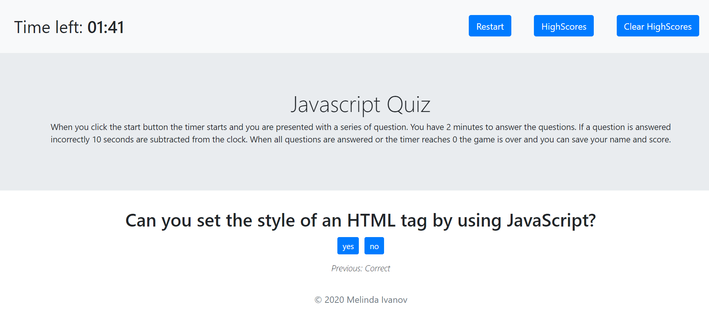

# Code-Quiz

This application prepares you for JavaScript interviews. When you click the start button the timer starts and you are presented with a series of question. You have 2 minutes to answer the questions. If a question is answered incorrectly 10 seconds are subtracted from the clock. When you have less than 10 seconds the clock changes to red. When all questions are answered or the timer reaches 0 the game is over, your score is presented and you can save your name and score. You can check the scores by clicking on HighScores and you can clear them by clicking Clear HighScores.

quiz demo:

input demo:

**Author:** Melinda Ivanov

## Links
- https://github.com/jnsmelinda/Code-Quiz
- https://jnsmelinda.github.io/Code-Quiz

## Technologies
- [JavaScript](https://www.javascript.com)
- [HTML5](https://en.wikipedia.org/wiki/HTML5)
- [CSS3](https://en.wikipedia.org/wiki/Cascading_Style_Sheets)
- [Git](https://git-scm.com/), [GitHub](https://github.com)
- [Github Pages](https://pages.github.com)

## Steps of developement
- creatiin project files
- desingning project
- create .editorconfig
- creating timer
- adding buttons
- handling quiz flow
- dinamically generating buttons
- tracking and displayin score
- saving score to localstorage
- displaying highScores table
- adding game description
- adding questions
- formatting time
- adding footer
- refactoring and cleanup
- readme

## Others
Original files and desing are from the [University of Washington coding bootcamp](https://bootcamp.uw.edu).

© 2020 Melinda Ivanov
